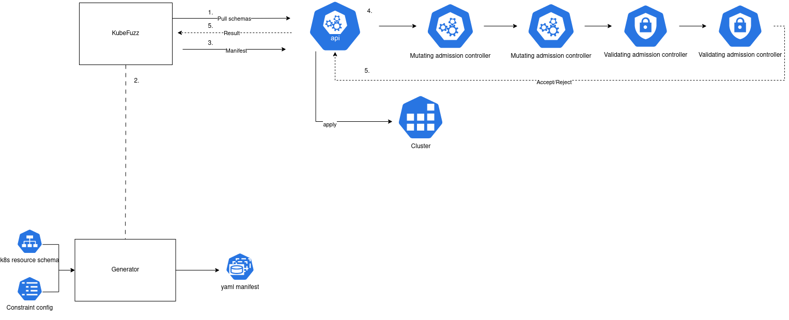

[](https://app.netlify.com/sites/venerable-elf-25fd96/deploys)

# Kubefuzz



Kubefuzz is a generative and mutative fuzzer for kubernetes admission controller chains.
It can be used to uncover unexpected behavior in complex admission controller setups. It works
by generating and mutating kubernetes resources according to the schema supplied by the cluster
openapi scheme, and a user written constrain config that further limits what fields are generated
and how.

[](https://asciinema.org/a/6rkj1Uy0S9t3ZOEBl9wbkUUu4)

# Building

```
git clone https://github.com/avolens/kubefuzz
cd kubefuzz
cargo build -r 
```

# Documenation

Documenation is available at https://kubefuzz.kubernetes-security.com/
