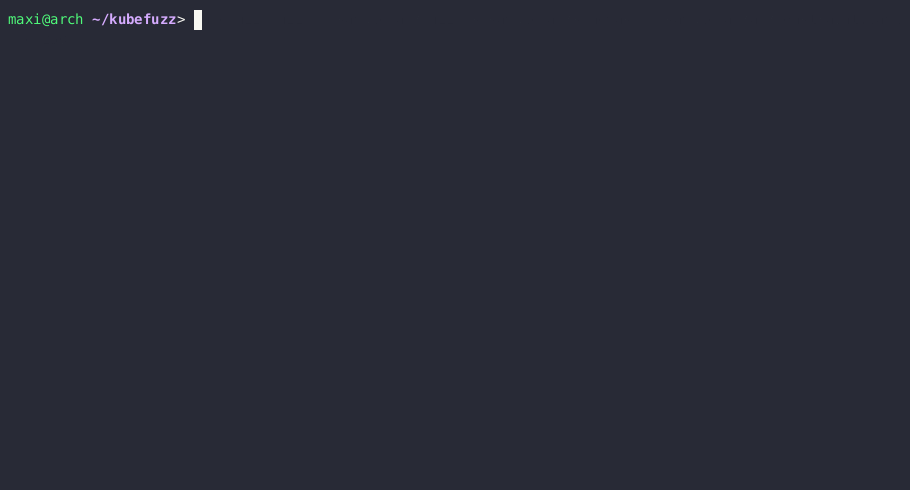
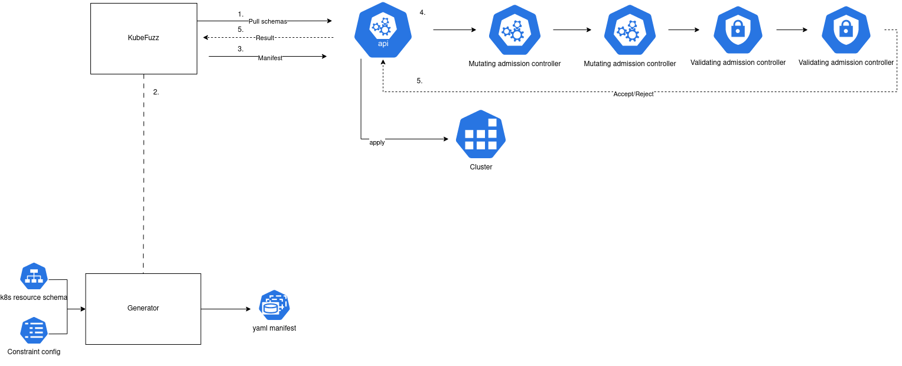

[](https://app.netlify.com/sites/venerable-elf-25fd96/deploys)

# Kubefuzz



Kubefuzz is a generative and mutative fuzzer for [Kubernetes admission controller](https://kubernetes.io/docs/reference/access-authn-authz/admission-controllers/) chains. It can be used to uncover unexpected behavior in complex admission controller setups. It works by generating and mutating Kubernetes resources according to the schema supplied by the cluster openapi scheme, and a user written constrain config that further limits what fields are generated and how.

# Architecture



# Use Cases

Kubefuzz offers a diverse range of practical applications within Kubernetes environments.

Firstly, it serves as a valuable tool for evaluating the robustness of an existing Admission Controller chain. Kubefuzz accomplishes this by generating a multitude of distinct manifests and subsequently subjecting them to tests to determine whether an Admission Controller rejects them. Additionally, it supports the utilization of sample constraints like the CIS benchmark for comprehensive testing.

Another significant use case involves the application of fuzz testing to assess the resilience of Admission Controller software. In instances where an Admission Controller exhibits a bug, there exists the potential for manifests to be deployed into the cluster, contingent upon the `failurePolicy` configuration. When this parameter is configured as 'Open', a crash of the Admission controller results in the automatic acceptance of the corresponding manifest.

# Example

In the example directory, you can find an example Admission Controller. Have fun fuzzing it.

# Documenation

Documenation is available at [https://kubefuzz.io/](https://kubefuzz.io)

# Building

```
git clone https://github.com/avolens/kubefuzz
cd kubefuzz
cargo build -r
```
